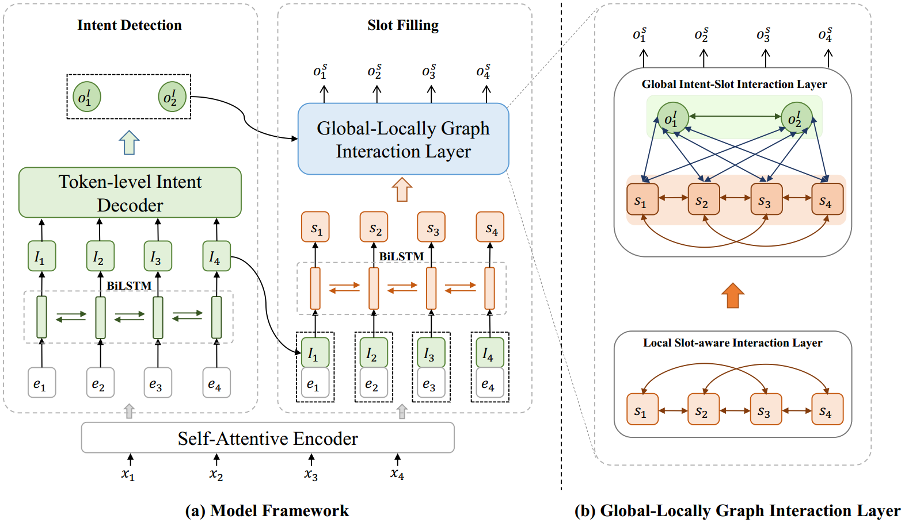
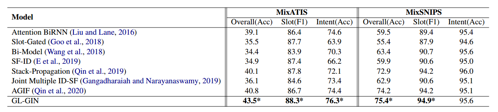

# GL-GIN: Fast and Accurate Non-Autoregressive Model for Joint Multiple Intent Detection and Slot Filling

This repository contains the official `PyTorch` implementation of the paper: [Libo Qin](http://ir.hit.edu.cn/~lbqin/), [Fuxuan Wei], [Tianbao Xie], [Xiao Xu](https://looperxx.github.io/), [Wanxiang Che](http://ir.hit.edu.cn/~car/chinese.htm), [Ting Liu](http://ir.hit.edu.cn/~liuting/).

If you use any source codes or the datasets included in this toolkit in your work, please cite the following paper. The bibtex are listed below:

.....to be filled

In the following, we will guide you how to use this repository step by step.

## Architecture



## Results



## Preparation

Our code is based on PyTorch 1.2 Required python packages:

-   numpy==1.19.1
-   tqdm==4.50.0
-   pytorch==1.2.0
-   python==3.6.12
-   cudatoolkit==9.2
-   fitlog==0.7.1
-   ordered-set==4.0.2

We highly suggest you using [Anaconda](https://www.anaconda.com/) to manage your python environment.

## How to run it
The script **train.py** acts as a main function to the project, you can run the experiments by the following commands.
```Shell
# MixATIS_clean dataset (ON GeForce RTX2080TI)
python train.py -g -bs=16 -dd=./data/MixATIS_clean  -sd=./save/MixATIS_clean -nh=4 -wed=128 -ied=128 -ehd=256 -sdhd=128 -dghd=64 -nldg=2 -sgw=2 -ne=200

# MixSNIPS_clean dataset (ON TITAN Xp)
python train.py -g -bs=16 -dd=./data/MixSNIPS_clean  -sd=./save/MixSNIPS_clean -nh=8 -wed=64 -ied=128 -ehd=256 -sdhd=128 -dghd=128 -nldg=2 -sgw=1 -ne=100
```

You can directly load the best models we saved:
```Shell
# MixATIS_clean dataset
python train.py -g -ne=0 -dd=./data/MixATIS_clean -sd=./save/MixATIS_best

# MixSNIPS_clean dataset
python train.py -g -ne=0 -dd=./data/MixSNIPS_clean -sd=./save/MixSNIPS_best
```


If you have any question, please issue the project or email [me](mailto:lbqin@ir.hit.edu.cn) or [fuxuanwei](mailto:fuxuanwei@ir.hit.edu.cn) and we will reply you soon.


